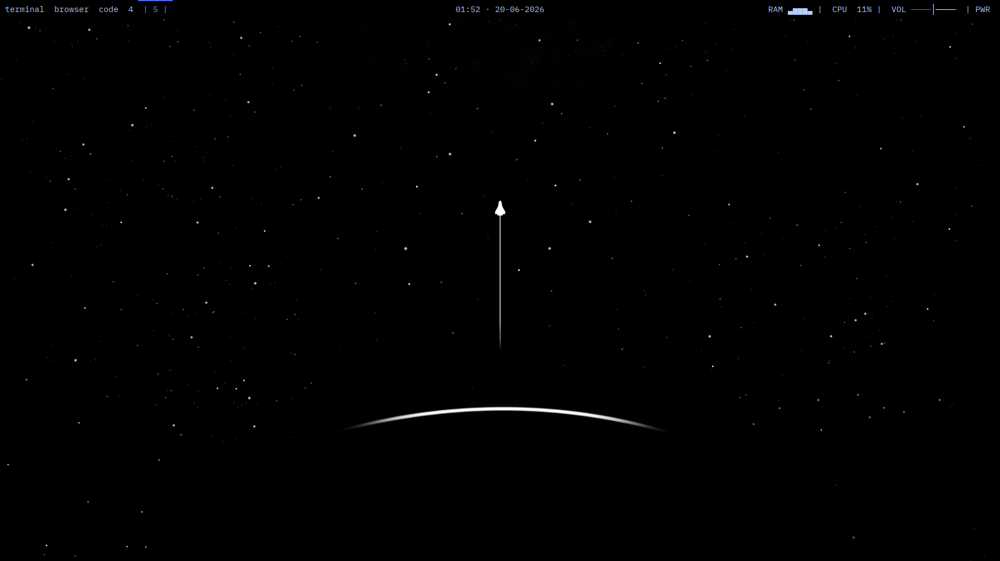
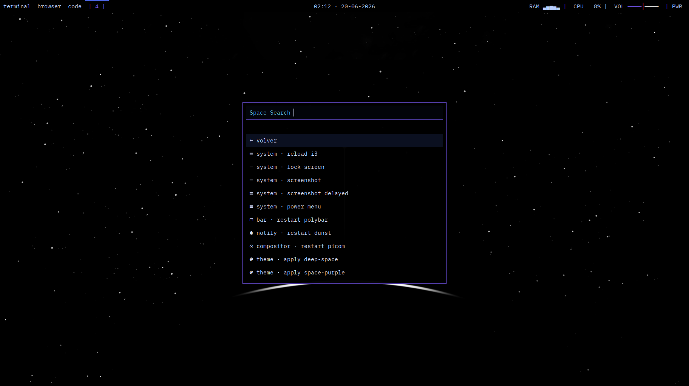
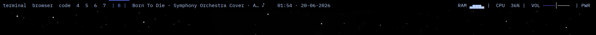

```text
 
░██████╗████████╗░█████╗░░█████╗░██╗░░██╗  ██╗██████╗░  ░██████╗██████╗░░█████╗░░█████╗░███████╗
██╔════╝╚══██╔══╝██╔══██╗██╔══██╗██║░██╔╝  ██║╚════██╗  ██╔════╝██╔══██╗██╔══██╗██╔══██╗██╔════╝
╚█████╗░░░░██║░░░███████║██║░░╚═╝█████═╝░  ██║░█████╔╝  ╚█████╗░██████╔╝███████║██║░░╚═╝█████╗░░
░╚═══██╗░░░██║░░░██╔══██║██║░░██╗██╔═██╗░  ██║░╚═══██╗  ░╚═══██╗██╔═══╝░██╔══██║██║░░██╗██╔══╝░░
██████╔╝░░░██║░░░██║░░██║╚█████╔╝██║░╚██╗  ██║██████╔╝  ██████╔╝██║░░░░░██║░░██║╚█████╔╝███████╗
╚═════╝░░░░╚═╝░░░╚═╝░░╚═╝░╚════╝░╚═╝░░╚═╝  ╚═╝╚═════╝░  ╚═════╝░╚═╝░░░░░╚═╝░░╚═╝░╚════╝░╚══════╝    
```

**STACKI3-Space** — escritorio **keyboard-first** para Linux Mint/X11: terminal, tmux e i3 trabajando juntos, sin ruido visual.

[](#)
[](#)
[](#)
[](#)
[](#)

> Inspirado en la filosofía Omarchy, pero en **i3 + X11**: sin migrar a Hyprland/Wayland, sin perder Linux Mint como base.

Landing pública: [`davidbritto.github.io/stacki3-space`](https://davidbritto.github.io/stacki3-space)

---

## Vista previa

| Escritorio | Menú SPACE |
|:---:|:---:|
|  |  |

| Polybar | Wallpaper |
|:---:|:---:|
|  |  |

---

## ¿Qué es?

STACKI3-Space empaqueta un flujo de trabajo real — no un demo de atajos — en un instalador que despliega dotfiles, scripts y temas a tu `$HOME`.

**No es** un escritorio donde cada app tiene su propio binding en i3.

**Sí es** esto:

```text
terminal → tmux → trabajo
     ↑
 i3, Rofi y overlays solo donde quitan fricción de verdad
```

### Stack principal

| Capa | Herramientas |
|------|--------------|
| Ventanas | i3wm, Picom |
| Trabajo | Kitty, tmux, Zsh, Zinit, Oh My Posh, Atuin |
| Superficie global | `space` CLI, Rofi, deskmenu |
| Estado | Polybar (compacta, silenciosa cuando todo está bien) |
| Notificaciones | Dunst (oscuro, cuadrado) |
| Navegación shell | fzf, zoxide, ripgrep, fd, eza, `try` |
| Archivos | Yazi desde terminal/tmux |
| Temas | `deep-space`, `space-purple`, `space-lime` y `montana` con switcher global |

Apps de apoyo incluidas en el flujo: qutebrowser, Zathura, lazygit, lazyjournal, alsamixer, nmtui, Neovim/LazyVim con tema deep-space.

---

## Filosofía

- **Teclado primero** — el ratón existe, no manda.
- **Terminal primero** — tmux es el hub de trabajo.
- **Poco ruido visual** — paleta deep-space, bordes cuadrados, barra quieta.
- **Menús útiles** — acciones finales en Rofi, no callejones sin salida.
- **Omarchy-like, Mint-native** — funciones y herramientas del ecosistema Omarchy, sobre Ubuntu/Mint sin cambiar de distro.

---

## Atajos esenciales

| Atajo | Acción |
|-------|--------|
| `Mod+Enter` | Terminal en el workspace actual (sin forzar tmux attach) |
| `Mod+Shift+Enter` | Terminal tmux principal en workspace `terminal` |
| `Mod+d` | Lanzador de apps |
| `Mod+p` | Búsqueda global SPACE |
| `Mod+'` | Cambiar ventana |
| `Mod+Shift+p` | Sessionizer de proyectos |
| `Mod+grave` | Menú TUI overlay |
| `Mod+Shift+v` | Menú del portapapeles |
| `Mod+F1` | Manuales integrados |
| `Mod+b` | qutebrowser |
| `Mod+Shift+x` | Bloquear sesión |

**Workspaces con intención:** `1:terminal` como ancla opcional, `9` para Spotify (renombrado en vivo desde MPRIS: `9: Track · Artist ♪`), el resto contextual.

---

## Instalación

### Requisitos

- Linux Mint o derivado Debian/Ubuntu-like
- Sesión **X11** con **i3** como entorno de trabajo
- Git y conexión a red (o paquete offline)

### Recomendada — APT en Mint/X11

```bash
sudo install -d -m 0755 /etc/apt/keyrings
curl -fsSL https://davidbritto.github.io/stacki3-space/stacki3-space-archive-keyring.asc \
  | sudo tee /etc/apt/keyrings/stacki3-space.asc >/dev/null
echo "deb [arch=amd64 signed-by=/etc/apt/keyrings/stacki3-space.asc] https://davidbritto.github.io/stacki3-space stable main" \
  | sudo tee /etc/apt/sources.list.d/stacki3-space.list >/dev/null
sudo apt update
sudo apt install stacki3-space
stacki3-space apply --deps
```

`apt` instala y actualiza STACKI3-Space en `/usr/share/stacki3-space`. Tus archivos en `$HOME` solo cambian cuando ejecutas explícitamente `stacki3-space apply`, que mantiene backups bajo `~/.local/state/stacki3-space/backups/`.

Si el repositorio todavía no está firmado en tu fork, usa temporalmente:

```bash
echo "deb [trusted=yes arch=amd64] https://davidbritto.github.io/stacki3-space stable main" \
  | sudo tee /etc/apt/sources.list.d/stacki3-space.list >/dev/null
```

### Desarrollo — checkout local

```bash
git clone https://github.com/DavidBritto/stacki3-space.git
cd stacki3-space
bash install.sh --deps
```

`--deps` instala paquetes APT oficiales y despliega el payload. Solo config (dependencias ya instaladas):

```bash
bash install.sh
```

### Instalador remoto (sin clonar)

Cuando solo tienes `install.sh` y no el checkout completo:

```bash
STACKI3_SPACE_REPO_URL=https://github.com/DavidBritto/stacki3-space.git bash install.sh --deps
```

### Preservar tu `.zshrc`

Por defecto el instalador **no pisa** un `~/.zshrc` existente; solo agrega aliases seguros (por ejemplo `lj` → lazyjournal). Para reemplazarlo en una máquina limpia:

```bash
STACKI3_SPACE_OVERWRITE_ZSHRC=1 bash install.sh
```

### Paquete offline

En la máquina origen:

```bash
scripts/package.sh
scp dist/stacki3-space-package.tar.gz user@destino:~/
```

En destino:

```bash
tar -xzf ~/stacki3-space-package.tar.gz
cd ~/stacki3-space-package
bash install.sh --deps
```

Guía completa de máquina nueva: [`docs/new-machine-install.md`](./docs/new-machine-install.md).
Detalles del repositorio APT: [`docs/apt-repository.md`](./docs/apt-repository.md).

---

## Comando `space`

Superficie CLI unificada del escritorio:

```bash
space search              # búsqueda global
space menu                # menú por categorías
space menu projects       # acceso directo a proyectos
space theme apply deep-space
space wall next
space bar restart
space system reload
space doctor              # chequeo de comandos core
```

Helpers de compatibilidad: `deskmenu`, `stack-theme`, `stack-wall`, `tui-panel`, `fd`, `try`.

---

## Temas

Tres paletas seleccionables con backup automático antes de cada apply:

```bash
stack-theme list
stack-theme apply deep-space    # negro deep-space (default)
stack-theme apply space-purple  # variante violeta
stack-theme apply space-lime    # full dark con acentos cian/lima
stack-theme apply montana       # Montana / Vira Dark (teal + azul)
stack-theme restore-last

Para Cursor/Kiro, instala la extensión local del tema Montana:

```bash
bash scripts/install-stackd-theme.sh
```

Luego elige **Stackd Montana** en el selector de temas del editor.
```

El switcher sincroniza i3, Polybar, Rofi, Dunst, Picom, tmux, Kitty, Zsh/Oh My Posh, GTK y archivos de editor incluidos en el stack.

---

## Polybar

Barra intencionalmente silenciosa:

- **Izquierda:** workspaces i3
- **Centro:** fecha/hora — click en la fecha abre el calendario TUI compacto
- **Derecha:** RAM, CPU, volumen, energía
- **Updates:** icono violeta `↻` junto a la fecha solo cuando hay actualizaciones pendientes

La música vive en el workspace `9` (Spotify + watcher MPRIS), no duplicada en la barra.

---

## Estructura del repo

```text
stacki3-space/
├── install.sh          # instalador local o remoto
├── stack.md            # modelo operativo del stack (léelo primero)
├── payload/            # dotfiles desplegados a $HOME
│   ├── .config/        # i3, polybar, rofi, dunst, picom, temas…
│   └── .local/bin/     # space, stack-theme, tui-panel…
├── scripts/            # dependencias, empaquetado, verificación
├── docs/               # guías de instalación y dependencias
└── tests/              # pruebas de integración del payload
```

---

## Documentación

| Documento | Contenido |
|-----------|-----------|
| [`stack.md`](./stack.md) | Modelo operativo, apps canónicas, atajos |
| [`docs/apt-repository.md`](./docs/apt-repository.md) | Publicación y actualización por APT |
| [`docs/dependencies.md`](./docs/dependencies.md) | Paquetes APT y herramientas externas |
| [`docs/new-machine-install.md`](./docs/new-machine-install.md) | Transición completa a Mint/X11 |
| [`docs/package-verification.md`](./docs/package-verification.md) | Build local, inspección y prueba del `.deb` |
| [`docs/migration-manifest.md`](./docs/migration-manifest.md) | Plan de migración entre máquinas |
| [`AGENTS.md`](./AGENTS.md) | Guía para contribuidores y agentes |

---

## Verificación

```bash
# Sintaxis shell
bash -n install.sh
find payload -type f -name '*.sh' -exec bash -n {} +

# Python helpers
python3 -m py_compile payload/.config/i3/spotify_workspace_name.py

# Suite de tests (requiere pytest)
python3 -m pytest tests/ -q

# Paquete Debian
dpkg-buildpackage -us -uc -b
dpkg-deb --contents ../stacki3-space_*_all.deb

# Post-instalación
scripts/verify-install.sh
```

Tras cambios en i3/Polybar: `i3-msg reload` y reiniciar Polybar con `payload/.config/polybar/launch.sh`.

---

## Créditos e inspiración

- Filosofía y herramientas shell inspiradas en **[Omarchy](https://omarchy.org)** — adaptadas a i3/X11 en Linux Mint.

---

## Licencia

[MIT](./LICENSE)
